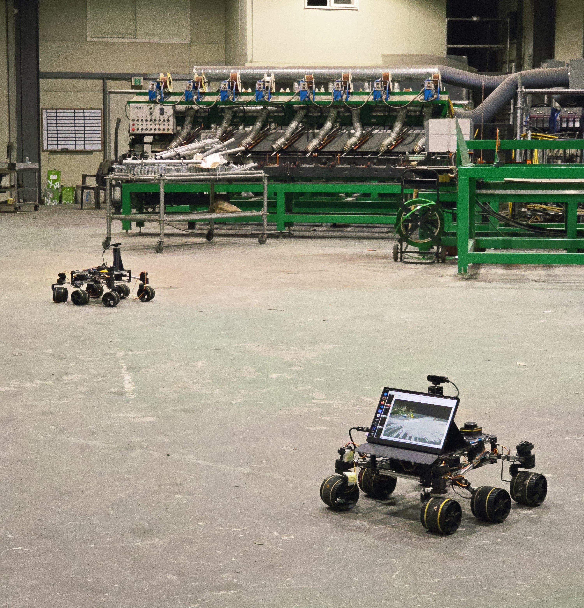
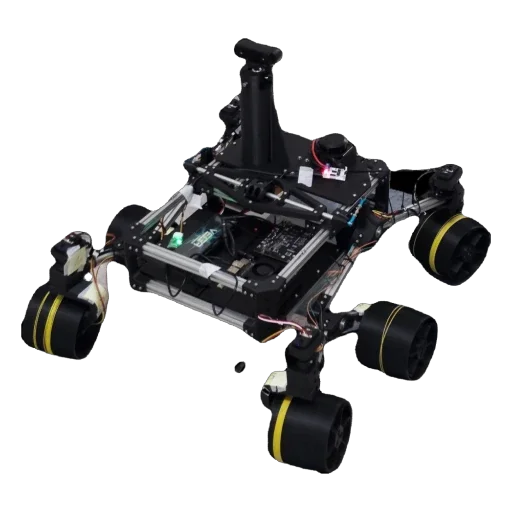
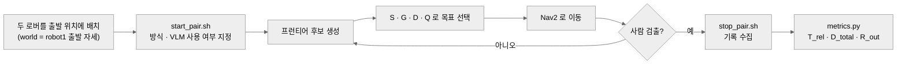
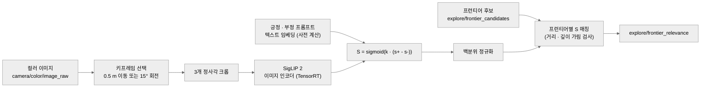
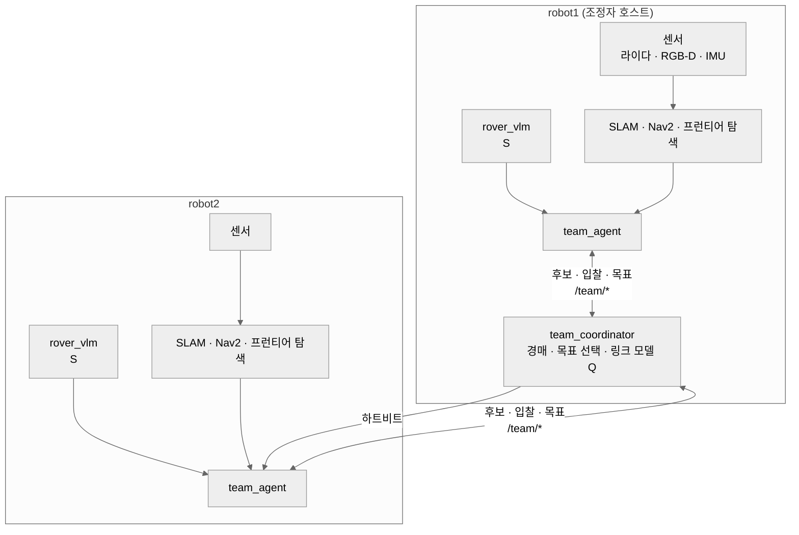

<div align="center">

# Link-US (vlm-comm-exploration)

### VLM 의미 정보와 Wi-Fi 통신 품질을 함께 고려하는 2대 로버 협력 탐색

<!-- TODO: 슬로건 -->



<!-- TODO: 탐색 데모 GIF (docs/images/demo.gif) -->


**<!-- TODO: 대회/수업/프로젝트명 -->** · 통신 제약 환경에서의 VLM 기반 다중 로봇 탐색 · 팀 **<!-- TODO: 팀 이름 -->**

<!-- TODO: [데모](링크) · [논문/보고서](링크) -->

</div>

---

## 📑 목차

1. [프로젝트 개요](#-프로젝트-개요)
2. [개발 배경](#-개발-배경)
3. [개발 목표](#-개발-목표)
4. [핵심 기능](#-핵심-기능)
5. [사용 흐름](#-사용-흐름)
6. [기술 스택](#-기술-스택)
7. [모델 / 파이프라인](#-모델--파이프라인)
8. [실험 평가](#-실험-평가)
9. [하드웨어 구성](#-하드웨어-구성)
10. [동작 · 통신 흐름](#-동작--통신-흐름)
11. [프로젝트 구조](#-프로젝트-구조)
12. [실행 방법](#-실행-방법)
13. [진행 사항 & 추후 계획](#-진행-사항--추후-계획)
14. [참고 문헌](#-참고-문헌)

---

## 🧩 프로젝트 개요

Wi-Fi 로 연결된 **로버 2대(robot1, robot2)** 가 미지의 실내 공간을 함께 탐색하며 **사람(요구조자)** 을 찾는 ROS 2 프로젝트입니다. 각 프런티어(탐색 경계)를 **VLM 의미 관련도(S)**, **정보 이득(G)**, **이동 비용(D)**, **예측 통신 품질(Q)** 로 평가해 두 로봇의 목표를 함께 정합니다.

> 사람이 있을 법한 곳을 우선 탐색하되, 통신이 끊기는 곳으로는 보내지 않습니다.

| 영역 | 기능 |
|------|------|
| **의미 관련도** | SigLIP 2 로 카메라 이미지 크롭이 "실종자 수색에 관련된 실내 영역"인지 점수화 (`rover_vlm`) |
| **다중 로봇 협력** | 조정자(robot1) + 에이전트(각 로봇) 구조의 경매·공동 목표 선택 (`rover_multi`) |
| **통신 인지** | Wi-Fi RSSI 로 AP 기준 경로 손실 모델을 맞춰 프런티어의 예상 RSSI 를 예측 |
| **탐색·내비게이션** | 프런티어 탐색 + Nav2 + RTAB-Map SLAM (`frontier_exploration_ros2`) |
| **사람 검출** | YOLO(`person`/`fire`) + TensorRT 로 검출하고 깊이로 지도상 위치 추정 (`rover_object`) |
| **실험 도구** | 2대 동시 실행·기록 스크립트와 T_rel·D_total·R_out 지표 계산 (`experiment_kit`, `experiment_eval`) |

> ⚠️ 실험은 인터넷이 없는 전용 Wi-Fi(`linkus`) 에서 진행하며, 목표(사람)는 한 위치에 가만히 있다고 가정합니다.

---

## 📊 개발 배경

<!-- TODO: 기획 배경·문제 정의·통계·인터뷰 자료 (저장소에서 확인되지 않음) -->

### 01. 선택 방식 비교

`team.yaml` 의 `selection` 주석 기준으로, 네 가지 방식은 같은 효용식 `U = α·S + (1-α)·G - λ·D` 를 쓰고 사용하는 요소만 다릅니다. 의미(S) 가 없는 방식은 모든 프런티어에 S = `semantic_default` (상수) 를 줍니다.

| 방식 (`selection_method`) | 의미 정보 S | 통신 조건 Q ≥ q_min |
|------|:---:|:---:|
| `frontier` | ❌ | ❌ |
| `comm_aware` | ❌ | ✅ |
| `semantic_only` | ✅ | ❌ |
| `proposed` | ✅ | ✅ |

---

## 🎯 개발 목표

> 통신 가능 범위를 지키면서, 의미 정보로 사람을 더 빨리 찾는 다중 로봇 탐색을 실제 로버로 검증합니다.

- `proposed` 를 `frontier` 등 기준 방식과 같은 조건에서 반복 비교
- 발견 시간(T_rel), 이동 거리(D_total), 통신 이탈 비율(R_out) 측정

---

## ✨ 핵심 기능

### ① VLM 프런티어 관련도 — 사람이 있을 법한 곳부터

카메라 이미지를 가로로 **3개의 정사각 크롭**으로 나눠 SigLIP 2 로 점수화하고, 프런티어를 가장 정면에서 본 크롭의 점수를 그 프런티어의 S 로 씁니다. 아직 본 적 없는 프런티어는 "미관측"으로 두어 근거 없는 점수를 주지 않습니다.

- **①-1. 프롬프트 집합 비교** — 긍정·부정 프롬프트 임베딩을 각각 평균해 유사도 차이를 시그모이드로 변환 (`similarity: scaled`)
- **①-2. 백분위 정규화** — 로봇이 지금까지 점수화한 크롭 중 순위(0~1)로 S 를 정규화 (`normalization: percentile`)
- **①-3. 깊이 가림 검사** — 더 가까운 물체에 가려진 시야는 제외 (`use_depth_occlusion: true`)

### ② 통신 품질 예측 — 끊기는 곳에는 보내지 않는다

`/team/link_quality` 측정값으로 AP 기준 로그거리 경로손실 모델을 주기적으로 다시 맞추고, 프런티어 위치의 예상 RSSI 를 Q 로 씁니다. 모든 후보가 Q 미달이면 링크가 좋았던 곳에서 대기합니다.

- **②-1. 경로손실 모델** — `p0_prior_dbm: -24.0`, `n_prior: 4.04` 사전값 + 측정 잔차 보정 (`link_model.py`)
- **②-2. 하트비트** — 조정자가 `timeout_s: 4.0` 초 동안 조용하면 에이전트가 단독 탐색으로 전환
- **②-3. 링크 프로브** — `link_probe`, `wifi_monitor` 노드로 RSSI·손실·RTT 측정

### ③ 2단 구조 다중 로봇 할당 — 두 로봇이 같은 곳을 가지 않는다

조정자(`team_coordinator`)가 두 로봇의 후보와 입찰을 모아 목표를 정하고, 각 로봇의 에이전트(`team_agent`)는 경로 비용을 계산해 입찰합니다. 목표 사이를 오가는 현상은 `switch_threshold`, `keep_goal_bonus` 로 억제합니다.

- **③-1. 경매·공동 선택** — 순차 단일 항목 경매(`auction`) 또는 공동 선택(`goal_selection.py`)
- **③-2. 실패 블랙리스트** — 실패한 목표 주변을 `max_failures: 2` 회 후 `60 s` 동안 제외
- **③-3. 동료 장애물** — 상대 로봇을 장애물로 반영 (`peer_obstacle_scan`)

### ④ 사람 검출·위치화 — 찾은 사람을 지도에 표시

YOLO 로 `person`, `fire` 를 검출하고 깊이 영상으로 지도 좌표를 추정해 같은 대상은 병합합니다 (`object_detector`, `object_mapper`).

- **④-1. TensorRT FP16 가속** — `max_rate_hz: 3.0` 으로 검출 빈도를 제한

---

## 🧭 사용 흐름



---

## 🛠 기술 스택

| 구분 | 기술 |
|------|------|
| **프레임워크** | ROS 2 Humble, `colcon`, DDS: `rmw_fastrtps_cpp` |
| **SLAM / 내비게이션** | RTAB-Map(`rtabmap_slam`), `slam_toolbox`, Nav2 (planner `Smac2D`, controller `RPP`/`TEB`), `rf2o_laser_odometry`, `robot_localization` |
| **탐색** | `frontier_exploration_ros2` (C++, MRTSP 솔버·프런티어 억제 포함) |
| **VLM** | SigLIP 2 base (`patch16-224`, `patch32-256`), ONNX → TensorRT FP16 엔진 |
| **객체 검출** | YOLO (`best.onnx` → TensorRT FP16 엔진), 클래스 `person`, `fire` |
| **센서·구동** | RPLIDAR C1, Orbbec Gemini 335, Adafruit BNO085, LX-16A 서보 (`ros2_rover` 기반) |
| **네트워크** | Wi-Fi(`linkus` 전용 공유기), RSSI·하트비트·프로브 |
| **분석** | Python (`metrics.py`, `compare_runs.py`, `rssi_loss.py`), `rosbag2` |

---

## 🧠 모델 / 파이프라인



`rover_vlm/config/vlm.yaml` 및 모델 메타 JSON 기준 값입니다.

| 항목 | 값 |
|------|------|
| 모델 | `google/siglip2-base-patch16-224` (임베딩 768, 입력 224) |
| 긍정 프롬프트 (6개) | `a photo of a person`, `a photo of a human`, `a person lying on the floor`, `a person sitting on the floor`, `an open doorway to a room`, `a place where a person could be hiding` |
| 부정 프롬프트 (5개) | `a blank wall`, `a plain white wall`, `a close-up of a wall`, `a photo of a floor`, `an empty corridor` |
| `n_crops` / `similarity` / `temperature` | `3` / `scaled` / `1.0` |
| `normalization` / `min_reference_crops` | `percentile` / `30` |
| 키프레임 | `max_keyframe_rate_hz: 2.0`, `min_translation_m: 0.5`, `min_rotation_deg: 15.0`, `max_keyframes: 500` |
| 가시 범위 | `0.5 ~ 6.0 m` |

**목표 선택 효용** (`rover_multi/config/team.yaml`)

| 항목 | 값 | 의미 |
|------|------|------|
| `alpha` | `0.5` | S 와 G 의 가중 |
| `lambda` | `1.0` | 이동 비용 D 의 가중 |
| `g_ref` | `700.0` | 미지 셀 수 기준 (반경 1.5 m 원, 0.1 m 격자) |
| `d_ref` | `25.0` | 경로 비용 기준 (m) |
| `q_min` | `-70.0` | 최소 예측 RSSI (dBm) |

---

## 📈 실험 평가

방식(`frontier` / `comm_aware` / `semantic_only` / `proposed`)별로 같은 위치의 사람을 찾는 실행을 반복하고 `experiment_eval/metrics.py` 로 지표를 계산합니다.

| 지표 | 정의 |
|------|------|
| **T_rel** | 첫 목표 부여부터, 사람이 카메라에 보이는 첫 RTAB-Map 프레임까지의 시간 (제한 시간 내 못 찾으면 실패) |
| **D_total** | 두 로봇 `/odom` 경로 길이의 합 |
| **R_out_rssi** | RSSI < `q_min` 이거나 미연결인 시간 비율 |
| **R_out_hb** | robot2 하트비트 공백이 `outage_gap_s` 를 넘은 시간 비율 |

<!-- TODO: 방식별 반복 실험 결과 표 (n, 성공률, T_rel, D_total, R_out). 현재 저장소에는 파이프라인 점검용 실행 1건(`experiment_eval/results_test`, 성공 0)뿐이라 성능 수치는 싣지 않습니다. -->

---

## 🔧 하드웨어 구성

Sawppy 로버(`ros2_rover` 포크 기반) 2대로 구성합니다.

| 부품 | 모델명 | 수량 | 역할 |
|------|------|:---:|------|
| 2D 라이다 | Slamtec RPLIDAR C1 | <!-- TODO --> | 지도·장애물 |
| RGB-D 카메라 | Orbbec Gemini 335 | <!-- TODO --> | VLM·검출·깊이 |
| IMU | Adafruit BNO085 | <!-- TODO --> | 자세 |
| 서보 | LX-16A (`/dev/lx16a`) | <!-- TODO --> | 구동·조향 |
| 연산 보드 | NVIDIA Jetson Orin Nano | 로봇당 1 | TensorRT 추론, ROS 2 |
| 공유기(AP) | `linkus` | 1 | 실험용 Wi-Fi |

<div align="center">

</div>

---

## 📡 동작 · 통신 흐름



- 두 로봇의 `/tf`, `/team/*` 는 전역이며 robot2 의 odom·map 은 Wi-Fi 로 robot1 에 들어옵니다.
- 공유 좌표계 `world` 는 robot1 출발 자세이고, robot2 의 출발 위치는 `world.yaml` 의 `robot2.initial_pose` (현재 `[0.0, -1.2, 0.0, 0.0]`) 입니다.

---

## 📁 프로젝트 구조

```
.
├── ros2_ws/src/                       # ROS 2 워크스페이스
│   ├── rover_multi/ ⭐                # 다중 로봇 bringup, 조정자·에이전트, 링크 모델
│   │   ├── config/                    # team.yaml, world.yaml
│   │   ├── launch/                    # robot / world / team_rviz launch
│   │   └── rover_multi/               # allocation, goal_selection, link_model ...
│   ├── rover_vlm/ ⭐                  # SigLIP 2 프런티어 관련도 (TensorRT)
│   ├── rover_object/                  # YOLO 사람·화재 검출, 객체 지도
│   ├── frontier_exploration_ros2/     # 프런티어 탐색 (C++)
│   ├── ros2_rover/                    # Sawppy 로버 기본 패키지 (외부)
│   ├── sllidar_ros2/                  # RPLIDAR 드라이버 (외부)
│   ├── OrbbecSDK_ROS2/                # Orbbec 카메라 드라이버 (외부)
│   └── rf2o_laser_odometry/           # 라이다 오도메트리 (외부)
├── experiment_kit/ ⭐                 # 2대 실행·정지·동기화 스크립트, RUNBOOK_ko.md
├── experiment_eval/ ⭐                # metrics.py 등 지표 계산
├── link_eval/                         # rssi_loss.py: RSSI 대비 손실·RTT 분석
├── run_scripts/                       # robot1 팀 실행·기록·RViz 스크립트
├── vlm_tools/                         # VLM 점검 도구
└── vlm_check/                         # VLM 점검용 이미지
```

---

## 🚀 실행 방법

### 사전 요구사항

- Ubuntu + **ROS 2 Humble**, `rosdep`, `colcon`
- NVIDIA Jetson Orin Nano (TensorRT) (VLM·YOLO 엔진 빌드: `rover_vlm/scripts/build_engine.sh`, `rover_object/scripts/build_engine.sh`)
- 두 로봇이 같은 Wi-Fi 에 연결되고 power save 가 꺼진 상태 (RUNBOOK 참고)

### 환경변수

| 이름 | 설명 |
|------|------|
| `RMW_IMPLEMENTATION=rmw_fastrtps_cpp` | DDS 구현 (`run_scripts/env.sh` 에서 설정) |
| `ROBOT2_HOST=...` | robot2 IP (`experiment_kit/config.sh`) |
| `EXPECT_SSID=...` | 기대 SSID, 기본 `linkus` |
| `DEBUG_RVIZ=0\|1` | 1 이면 robot1 에서 RViz 실행 (Wi-Fi 부하 증가, 측정 실행에서는 끔) |

### 설치 & 실행

```bash
# 빌드
cd ~/ros2_ws
rosdep install --from-paths src -r -y
colcon build
source install/setup.bash

# robot1 단독: 조정자 + 탐색 (방식 선택)
bash ~/run_scripts/robot1_team.sh <frontier|comm_aware|semantic_only|proposed>

# 2대 실험 1회 (robot1 에서 실행)
bash ~/experiment_kit/sync_robot2.sh        # 코드 변경 후 robot2 로 전송·빌드
bash ~/experiment_kit/start_pair.sh <run_name> <method> <use_vlm 0|1> [person_id] ["note"] --front <m> --left|--right <m>
bash ~/experiment_kit/stop_pair.sh <run_name>

# 분석
python3 ~/experiment_eval/metrics.py runs.yaml
python3 ~/experiment_eval/compare_runs.py ~/experiment_runs/<run>
python3 ~/link_eval/rssi_loss.py <bag dir> [robot1]
```

실행 결과는 `~/experiment_runs/<run_name>/` 에 쌓입니다 (`manifest.yaml`, `params/`, `robot1_bag/`, `robot1.db`, `robot2/`). 자세한 절차는 `experiment_kit/RUNBOOK_ko.md` 를 참고합니다.

---

## 🚧 진행 사항 & 추후 계획

### 01. 진행 사항

- 2대 로버 협력 탐색(`rover_multi`), VLM 관련도(`rover_vlm`), 사람 검출(`rover_object`) 구현
- `frontier` / `comm_aware` / `semantic_only` / `proposed` 선택 방식 구현
- 실험 실행·기록·지표 계산 도구 구현
- 실험 기록(rosbag) 보유: `bags/` 의 `proposed`, `linktest`, `team_frontier_static_r2` 등

### 02. 이슈 및 변경 사항

- robot2 의 입찰이 느려 `bid_window_s` 를 15 s 로 늘림 (`team.yaml` 주석)
- `q_min` 을 소형 실내 설정(-52 dBm)에서 -70 dBm 으로 복귀 (`team.yaml` 주석)

### 03. 추후 계획

<!-- TODO: 추후 계획 -->

---

## 📚 참고 문헌

- [Sawppy the Rover](https://github.com/Roger-random/Sawppy_Rover) · [mgonzs13/ros2_rover](https://github.com/mgonzs13/ros2_rover) — 로버 하드웨어·ROS 2 패키지
- [SigLIP 2 (`google/siglip2-base-patch16-224`)](https://huggingface.co/google/siglip2-base-patch16-224) — VLM
- [RTAB-Map](https://github.com/introlab/rtabmap_ros), [Nav2](https://github.com/ros-navigation/navigation2), [slam_toolbox](https://github.com/SteveMacenski/slam_toolbox)
- [OrbbecSDK_ROS2](https://github.com/orbbec/OrbbecSDK_ROS2), [sllidar_ros2](https://github.com/Slamtec/sllidar_ros2), [rf2o_laser_odometry](https://github.com/MAPIRlab/rf2o_laser_odometry)
- [mertgulerx/frontier_exploration_ros2](https://github.com/mertgulerx/frontier_exploration_ros2) — 프런티어 탐색

---

<div align="center">

**Link-US (vlm-comm-exploration)** · VLM 의미 정보와 Wi-Fi 통신 품질을 함께 고려하는 2대 로버 협력 탐색

<!-- TODO: 슬로건 -->

</div>
